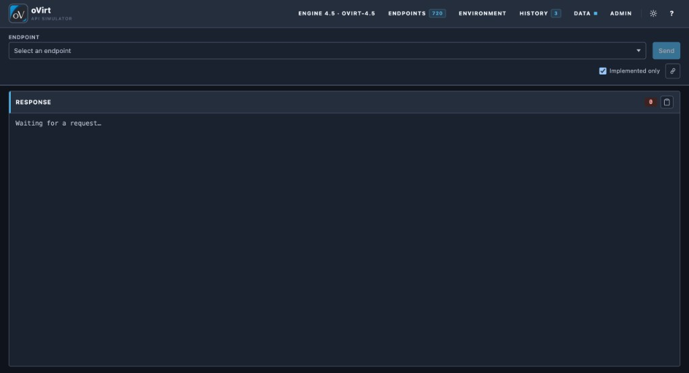

**Language / Язык:** [English](README.md) | [Русский](ru/README.md)

# Documentation

Guides for the oVirt / RHV Engine API simulator. Switch language with the header
on each page. Russian mirrors live under [`ru/`](ru/README.md).

| Guide | Description |
|---|---|
| [Getting started](getting-started.md) | First successful lab session |
| [Ports](ports.md) | Published Engine + UI ports |
| [Configuration](configuration.md) | Environment variables and Compose |
| [Authentication](authentication.md) | Basic auth, OAuth2, sessions |
| [API versions](api-versions.md) | Series packs 3.x / 4.x and Version header |
| [API coverage](api_coverage.md) | Operation counts and deltas per series |
| [API surface](api-surface.md) | Routing, handlers, schema engine |
| [Clients & examples](clients.md) | curl, Python, Ansible, Terraform |
| [Seed profiles](seed-profiles.md) | `minimal` and `demo` fixtures |
| [Domains](domains/README.md) | VMs, hosts, storage, networks, identity, jobs |
| [Web UI](web-ui.md) | Interactive console and catalogs |
| [Operations](operations.md) | Migrate, reseed, upgrade |
| [Kubernetes / Helm](kubernetes.md) | Cluster install (Service `:8080`) |
| [Security](security.md) | Lab threat model and credentials |
| [Observability](observability.md) | Health endpoints and logging |
| [Troubleshooting](troubleshooting.md) | Common failure modes |
| [FAQ](faq.md) | Short answers |
| [Architecture](architecture.md) | Component boundaries |

Runnable cookbooks: [`examples/`](../examples/README.md).  
Integration suites: [`pulumi-tests/`](../pulumi-tests/README.md).  
Contract packs: [`contracts/`](../contracts/README.md).

More screens and details: [Web UI](web-ui.md).
