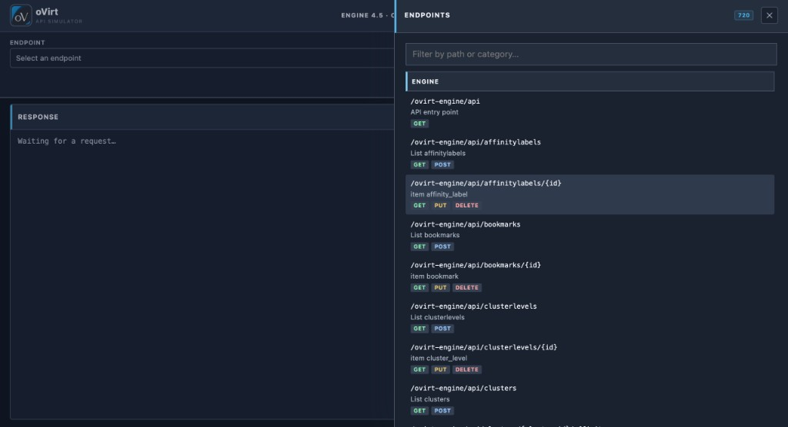
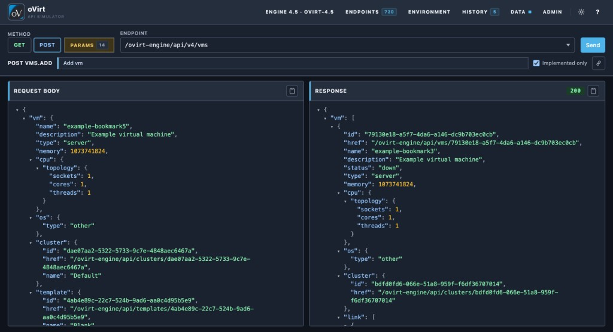
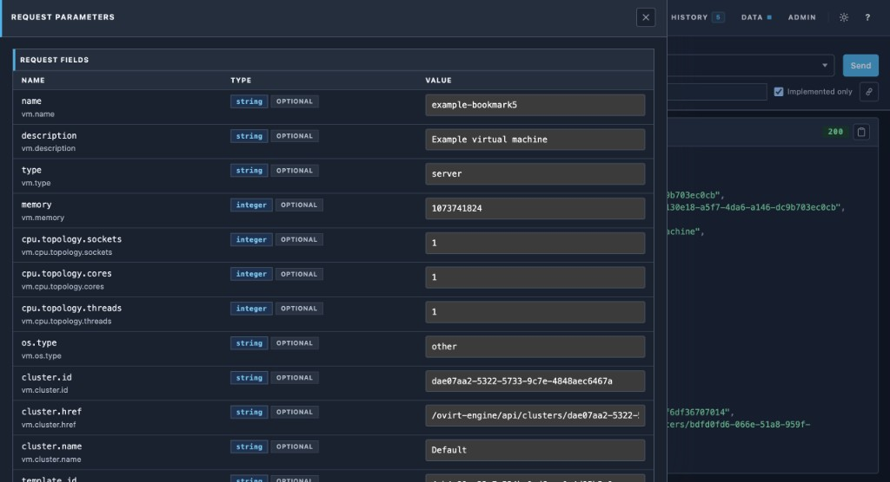
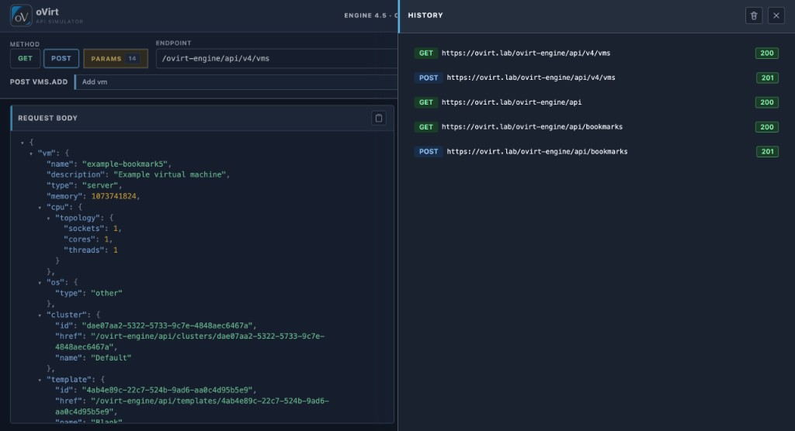
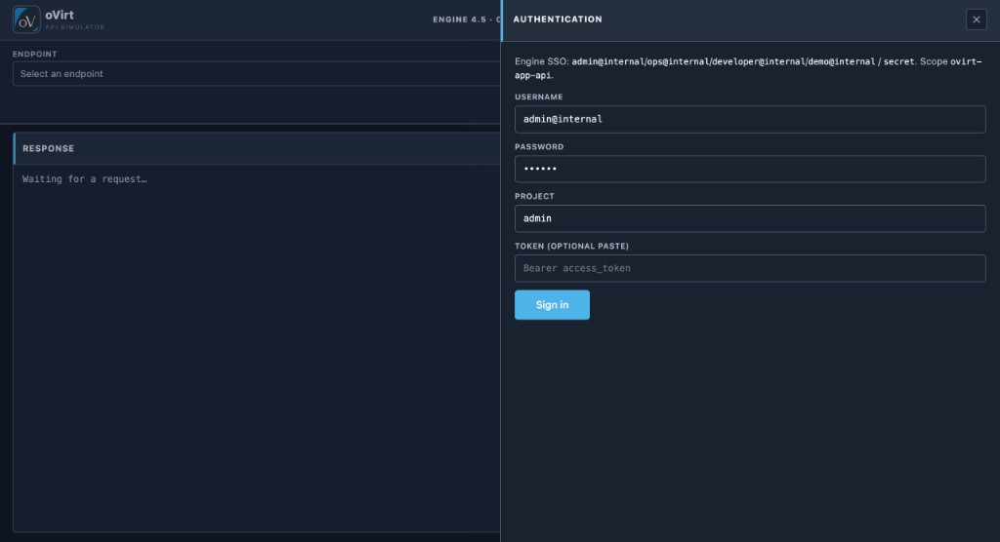
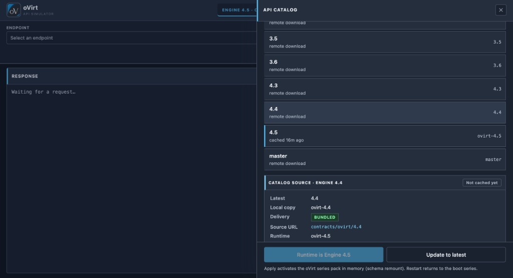
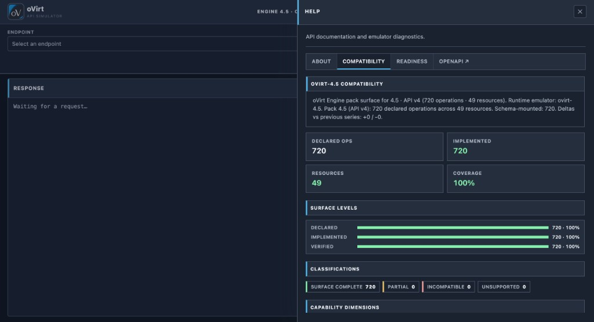
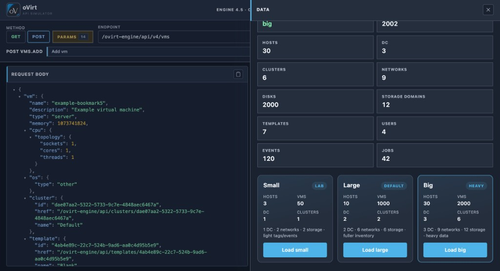
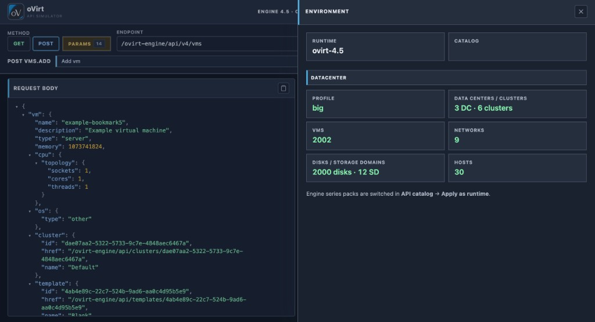

**Language / Язык:** [English](../web-ui.md) | [Русский](web-ui.md)

# Web UI

Интерактивная консоль: обзор операций контракта Engine, лабораторные токены,
Try-it запросы и управление seed-данными.

URL по умолчанию (Compose): [http://127.0.0.1:5000/](http://127.0.0.1:5000/)  
(При `make up-local` — локальный UI-порт из `.env`, например `6080` / `7080`.)

## Рабочая область

| Область | Назначение |
|---|---|
| Выбор endpoint | Поиск по путям контракта (series pack Engine) |
| Вкладки методов | `GET` / `POST` / `PUT` / `DELETE` для выбранного пути |
| Request body | JSON-пример в форме Engine для create/update/action |
| Params | Плоские path/body-поля для быстрых правок |
| Response | Статус + JSON-дерево последнего ответа |
| History | Недавние Try-it запросы (повтор / восстановление) |

Тела запросов соответствуют соглашению Engine (root-wrapper сущности или
`action`). В примерах — вложенные ссылки (`cluster`, `template`, CPU topology,
storage domains) под seed-инвентарь лаборатории, а не однополевой stub.

## Ящики (drawers)

| Ящик | Назначение |
|---|---|
| Authentication | SSO password grant / вставка Bearer-токена |
| API catalog | Обзор series packs; **Apply as runtime** — hot-swap |
| Help → Compatibility | Сводка declared / implemented / verified |
| Data | Reseed `minimal` / `small` / `large` / `big` |
| Environment | Runtime series + обзор инвентаря datacenter |

Лабораторные учётки: `admin@internal`, `ops@internal`, `developer@internal`,
`demo@internal` / `secret`. Scope: `ovirt-app-api`.

## Hot-swap series

Из **API catalog** → **Apply as runtime** (или UI API):

- `POST /ui/api/ovirt/contracts/activate` с `{"series":"4.4"}`
- `POST /ui/api/contract/apply?major=N`

Перемонтирует in-memory контрактные маршруты без пересборки образа. Рестарт
процесса возвращает cold-start `OVIRT_SERIES`. См. [Версии API](api-versions.md).

## Заметки

- Брендинг: oVirt blue `#0076B6` и charcoal `#1D2226`.
- UI ходит в тот же процесс симулятора, что и Engine API; отличается только
  опубликованный listener ([порты](ports.md)).
- OpenAPI: [http://127.0.0.1:5000/docs](http://127.0.0.1:5000/docs)
  (также на HTTPS-порту Engine).
